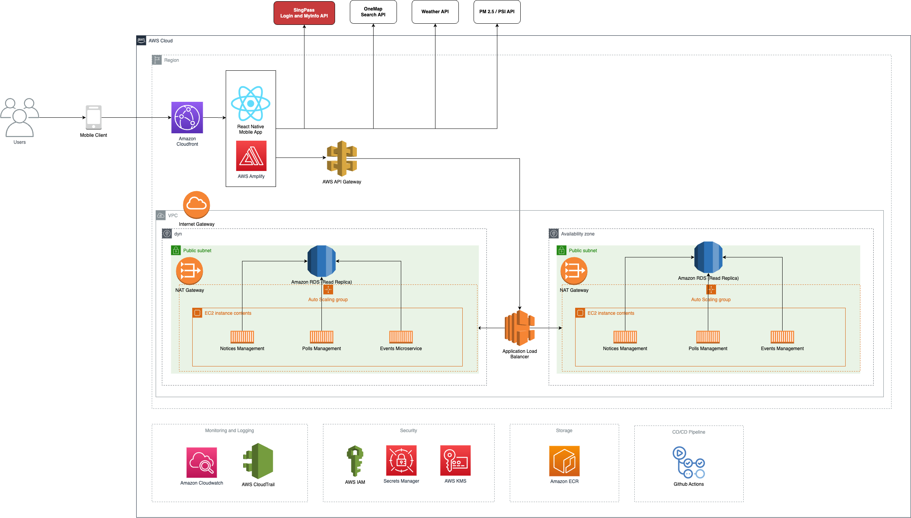

# CityConnect

Introducing CityConnect: Your one-stop neighbourhood companion app!

CityConnect is an innovative mobile app that empowers Singaporeans to with the latest up to date information to lead healthier, safer, and more engaged lives in our bustling city-state. Seamlessly integrated with SingPass, the app delivers real-time advisories on air quality, dengue outbreaks, construction notices, and upcoming events around your neighbourhood right at your fingertips.

With interactive polls, the relevant authorities could actively receive feedbacks to ensure that residents' needs are taken care of and encourages residents' to contribute to shape our urban environment. Join us in building a smarter, more connected Singapore with CityConnect – Where Information Meets Engagement!

## Problem Statement

In Singapore, a highly urbanized and densely populated city-state, residents face numerous challenges related to staying informed, engaged, and safe in their neighborhoods. Critical information such as air quality updates, dengue outbreak alerts, construction notices, and local events is often scattered across various platforms, making it difficult for citizens to access timely and relevant information. Additionally, the lack of an efficient feedback mechanism limits residents' ability to actively contribute to shaping their urban environment.

Furthermore, the existing methods of disseminating notices and events suffer from inefficiencies and limitations. For instance, the digital boards installed inside lifts, although present, are hindered by the need to rotate through various advertisements in different languages, reducing their effectiveness. Moreover, these boards are not universally deployed, leading to unequal access to crucial information across neighborhoods. Similarly, notices for essential services such as mosquito pest spray are distributed through printed paper, which often goes unnoticed or is forgotten, diminishing the overall effectiveness of such communication methods.

This fragmented approach to information and engagement hinders the quality of life and well-being of Singaporeans. To address these issues, there is a pressing need for a centralized and user-friendly platform that seamlessly delivers real-time advisories, fosters active participation through polls and feedback, and creates a strong sense of community. By bridging the gap between residents and authorities, this solution can empower individuals to make informed decisions, promote civic engagement, and collectively contribute to a safer, healthier, and more connected Singapore.

## Solution

The proposed solution is an app that allows users to login with SingPass (via Login and MyInfo API) and access relevant and timely information such as AQI, dengue, constructions, maintenance, events near them, etc. The app also enables the authorities to interact with the residents' through polls.

### Features

| **Feature**                      | **Description**                                                                                                                                              |
| -------------------------------- | ------------------------------------------------------------------------------------------------------------------------------------------------------------ |
| SingPass Integration             | Secure and seamless login using SingPass credentials for user authentication.                                                                                |
| Real-Time Advisories             | Receive real-time updates and advisories on air quality (AQI) levels. Get alerts for dengue outbreaks and related precautions.                               |
| Neighbourhood Notices            | Access construction and maintenance notices specific to your neighbourhood. Receive alerts for ongoing or upcoming projects in your vicinity.                |
| Local Events                     | Discover and explore events, workshops, and gatherings happening near you. Get detailed information, timings, and locations for local events.                |
| Interactive Polls                | Engage in polls to provide your opinions on neighbourhood matters and initiatives. Contribute to community decision-making and voice your preferences.       |
| Instant Alerts and Notifications | Receive emergency alerts and timely updates for critical situations. Stay informed about urgent developments that impact your neighborhood.                  |
| Personalised Reminders           | Receive reminders for upcoming maintenance, construction, or other scheduled activities. Get notifications before events such as mosquito pest sprays occur. |
| User-Friendly Interface          | Intuitive and easy-to-navigate app design for a seamless user experience. Quick access to essential information and features with a user-centric interface.  |
| Language Support                 | Multi-language support to cater to the diverse population of Singapore.                                                                                      |

### System Architecture

| **Component**                                                     | **Description**                                                                                                                                                                                                                                                                                                                                                                                       |
| ----------------------------------------------------------------- | ----------------------------------------------------------------------------------------------------------------------------------------------------------------------------------------------------------------------------------------------------------------------------------------------------------------------------------------------------------------------------------------------------- |
| Elastic Container Registry (ECR)                                  | Elastic Container Registry (ECR) is a fully managed Docker container registry, to store and manage my application's container images securely. This allows for easy deployment to ECS cluster.                                                                                                                                                                                                        |
| Amazon CloudFront                                                 | CloudFront as a content delivery network (CDN) to enhance the performance of the application. It helps deliver both static and dynamic content with low latency and high transfer speeds.                                                                                                                                                                                                             |
| SingPass Login and MyInfo API                                     | Utilising the SingPass Login and MyInfo API integration, users can seamlessly authenticate their identity and securely retrieve essential residential information, enabling the automatic population of accurate and up-to-date details for a streamlined and personalised experience.                                                                                                                |
| AWS API Gateway                                                   | Acts as the entry point for client requests, handling authentication, authorization, and request routing effectively.                                                                                                                                                                                                                                                                                 |
| Application Load Balancer (ALB) and Auto Scaling Groups (ASG)     | Application Load Balancer (ALB) evenly distributes incoming traffic across multiple instances of the application running in an Amazon Elastic Container Service (ECS) cluster. It works in conjunction with auto scaling groups to automatically adjust the number of container instances based on demand. The combined component will deliver high availability and scalability for the application. |
| AWS CloudWatch and AWS CloudTrail                                 | For monitoring and auditing purposes. CloudWatch helps to gain insights into the application's performance, health, and resource utilisation, while CloudTrail provides a detailed record of activities and actions within the AWS account                                                                                                                                                            |
| AWS IAM, AWS Key Management Service (KMS) and AWS Secrets Manager | IAM enables me to control access to my AWS resources, while KMS provides secure key storage and encryption services. Secrets Manager enables me to securely store and manage sensitive information like database credentials and API keys.                                                                                                                                                            |
| GitHub Actions                                                    | A Continuous Integration/Continuous Deployment (CI/CD) platform. Helps to streamlines the development and deployment cycles, making it easier to maintain and release updates to the application. For example, a pipeline to generate a new image, upload to the Elastic Container Registry (ECR) and deploy the new container automatically upon merging to the master/main branch.                  |

### Wireframe

#### Links

- [CityConnect Mobile App UI](https://xd.adobe.com/view/8ef78c18-c2e4-44e5-8bdb-f3d750e0f694-dba4/?fullscreen)
- [CityConnect Admin Portal (Complementary Portion)](https://xd.adobe.com/view/dc31a050-c250-477a-9f52-e9b296fbdc4a-8962/?fullscreen)
- [CityConnect Figma (Imported)](https://www.figma.com/file/clPwHqwywBK7NkBB9GGuzn/NDI-TAP?type=design&node-id=0%3A1&mode=design&t=0Cz1GEXaRhcR88yW-1)

#### Video Demo

https://github.com/xinweilau/CityConnect/assets/12653324/556a1403-ac47-4b4e-b30e-d9b619f7d34d

### Remarks

Unfortunately, I faced unexpected personal circumstances that prevented me from completing the assignment as intended. However, I'm genuinely enthusiastic about the National Digital Identity topic, and I believe that the proposal section I submitted reflects my dedication and interest. I hope my efforts in that aspect make up for the incomplete assignment. Thank you for your time and kind understanding.
